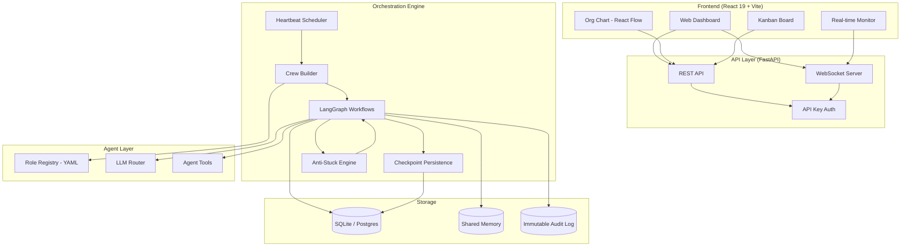

# SK AgentCorp — Implementation Plan

## Architecture Overview



## File Structure

```text
SK AgentCorp/
├── README.md
├── LICENSE
├── pyproject.toml
├── docker-compose.yml
├── Dockerfile
├── .env.example
├── .gitignore
│
├── backend/
│   ├── __init__.py
│   ├── main.py                    # FastAPI app entry
│   ├── config.py                  # Settings via Pydantic
│   ├── database.py                # SQLAlchemy engine + session
│   │
│   ├── models/                    # SQLAlchemy ORM models
│   │   ├── __init__.py
│   │   ├── company.py
│   │   ├── agent.py
│   │   ├── task.py
│   │   ├── audit.py
│   │   └── budget.py
│   │
│   ├── schemas/                   # Pydantic v2 schemas
│   │   ├── __init__.py
│   │   ├── company.py
│   │   ├── agent.py
│   │   ├── task.py
│   │   └── budget.py
│   │
│   ├── routers/                   # FastAPI routers
│   │   ├── __init__.py
│   │   ├── companies.py
│   │   ├── agents.py
│   │   ├── tasks.py
│   │   ├── dashboard.py
│   │   ├── budget.py
│   │   └── websocket.py
│   │
│   ├── services/                  # Business logic
│   │   ├── __init__.py
│   │   ├── company_service.py
│   │   ├── agent_service.py
│   │   ├── task_service.py
│   │   ├── budget_service.py
│   │   └── audit_service.py
│   │
│   ├── engine/                    # Core orchestration
│   │   ├── __init__.py
│   │   ├── heartbeat.py           # APScheduler heartbeat
│   │   ├── crew_builder.py        # Dynamic crew assembly
│   │   ├── workflow.py            # LangGraph stateful workflow
│   │   ├── anti_stuck.py          # Anti-stuck engine
│   │   ├── llm_router.py          # Multi-LLM provider router
│   │   ├── shared_memory.py       # Consensus shared memory
│   │   └── checkpoint_store.py    # SQLite checkpoint store
│   │
│   └── roles/                     # Role loader
│       ├── __init__.py
│       └── loader.py
│
├── roles/                         # YAML role definitions
│   ├── executive/
│   │   ├── ceo.yaml
│   │   ├── cto.yaml
│   │   ├── cfo.yaml
│   │   ├── cmo.yaml
│   │   └── coo.yaml
│   ├── engineering/
│   │   ├── lead_engineer.yaml
│   │   ├── frontend_dev.yaml
│   │   ├── backend_dev.yaml
│   │   ├── devops_engineer.yaml
│   │   ├── qa_engineer.yaml
│   │   ├── data_engineer.yaml
│   │   ├── ml_engineer.yaml
│   │   ├── security_engineer.yaml
│   │   ├── mobile_dev.yaml
│   │   └── architect.yaml
│   ├── marketing/
│   │   ├── marketing_director.yaml
│   │   ├── content_writer.yaml
│   │   ├── seo_specialist.yaml
│   │   ├── social_media_manager.yaml
│   │   ├── copywriter.yaml
│   │   ├── email_marketer.yaml
│   │   ├── growth_hacker.yaml
│   │   ├── brand_strategist.yaml
│   │   ├── video_producer.yaml
│   │   └── community_manager.yaml
│   ├── sales/
│   │   ├── sales_director.yaml
│   │   ├── account_executive.yaml
│   │   ├── sales_dev_rep.yaml
│   │   ├── customer_success.yaml
│   │   └── partnerships_manager.yaml
│   ├── product/
│   │   ├── product_manager.yaml
│   │   ├── ux_designer.yaml
│   │   ├── ui_designer.yaml
│   │   ├── product_analyst.yaml
│   │   └── ux_researcher.yaml
│   ├── operations/
│   │   ├── ops_manager.yaml
│   │   ├── project_manager.yaml
│   │   ├── hr_manager.yaml
│   │   ├── recruiter.yaml
│   │   ├── finance_analyst.yaml
│   │   ├── legal_counsel.yaml
│   │   └── office_manager.yaml
│   ├── data/
│   │   ├── data_scientist.yaml
│   │   ├── data_analyst.yaml
│   │   ├── bi_analyst.yaml
│   │   └── research_analyst.yaml
│   └── creative/
│       ├── creative_director.yaml
│       ├── graphic_designer.yaml
│       ├── content_strategist.yaml
│       └── technical_writer.yaml
│
├── templates/                     # Company templates
│   ├── saas_dev_agency.yaml
│   ├── content_factory.yaml
│   └── marketing_agency.yaml
│
├── cli/
│   ├── __init__.py
│   └── main.py                    # CLI entry (click/typer)
│
└── frontend/
    ├── package.json
    ├── vite.config.ts
    ├── tsconfig.json
    ├── index.html
    ├── components.json
    └── src/
        ├── main.tsx
        ├── App.tsx
        ├── index.css
        ├── lib/
        │   ├── utils.ts
        │   └── api.ts
        ├── hooks/
        │   ├── useWebSocket.ts
        │   └── useApi.ts
        ├── components/
        │   ├── ui/                # shadcn components
        │   ├── layout/
        │   │   ├── Sidebar.tsx
        │   │   ├── Header.tsx
        │   │   └── Layout.tsx
        │   ├── dashboard/
        │   │   ├── StatsCards.tsx
        │   │   ├── AgentStatus.tsx
        │   │   └── ActivityFeed.tsx
        │   ├── org-chart/
        │   │   └── OrgChart.tsx
        │   ├── kanban/
        │   │   └── KanbanBoard.tsx
        │   ├── budget/
        │   │   └── BudgetTracker.tsx
        │   └── audit/
        │       └── AuditLog.tsx
        └── pages/
            ├── DashboardPage.tsx
            ├── OrgChartPage.tsx
            ├── TasksPage.tsx
            ├── BudgetPage.tsx
            ├── AuditPage.tsx
            └── SettingsPage.tsx
```

## Build Order

### Phase 1: Backend Core

1. pyproject.toml, .env.example, .gitignore
2. backend/config.py, database.py
3. backend/models/ (all ORM models)
4. backend/schemas/ (Pydantic schemas)
5. backend/services/ (business logic)
6. backend/routers/ (API endpoints)
7. backend/main.py (FastAPI app)

### Phase 2: Orchestration Engine

1. backend/engine/llm_router.py
2. backend/engine/shared_memory.py
3. backend/engine/checkpoint_store.py
4. backend/engine/workflow.py (LangGraph)
5. backend/engine/anti_stuck.py
6. backend/engine/crew_builder.py
7. backend/engine/heartbeat.py

### Phase 3: Role System

1. backend/roles/loader.py
2. All 50+ YAML role files
3. 3 company templates

### Phase 4: CLI

1. cli/main.py

### Phase 5: Frontend

1. Scaffold Vite + React + TS
2. Install shadcn/ui + Tailwind + React Flow + Recharts
3. Layout components (Sidebar, Header)
4. Dashboard page + components
5. Org Chart page
6. Kanban / Tasks page
7. Budget page
8. Audit page
9. Settings page
10. WebSocket integration

### Phase 6: Docker & README

1. Dockerfile, docker-compose.yml
2. README.md (comprehensive)
